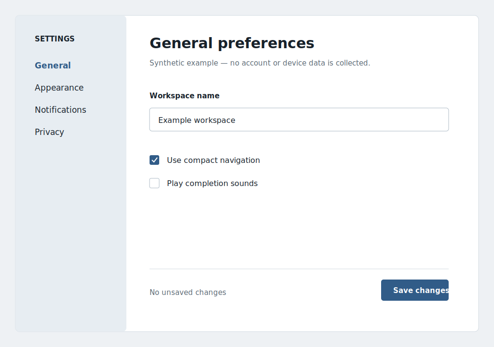

# Quiet desktop settings

Synthetic desktop application example.



The original concept used equal-weight groups and ambiguous save behavior. The
approved direction keeps account, appearance, and notification settings in a
single keyboard-friendly form with a persistent status line.

- `design-lock.json`: approved 1024 × 720 reference.
- `asset-manifest.json`: all labels and controls are semantic.
- `demo.py`: runnable standard-library Tkinter implementation.
- `comparison-summary.json`: synthetic review record.

Run with:

```bash
python demo.py
```
