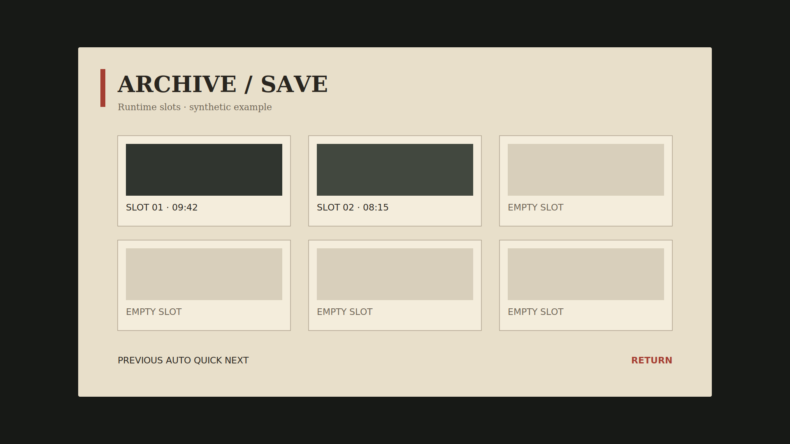

# Archive save menu

Synthetic Ren'Py example with fictional slot names and no game artwork.

The visual reference separates atmospheric material from runtime controls:
paper texture and ornamental framing may become image-native assets, while slot
names, timestamps, focus, pagination, and actions remain semantic Ren'Py code.

- `design-lock.json`: approved 1920 × 1080 reference.
- `asset-manifest.json`: resolved hybrid implementation plan.
- `screen.rpy`: maintainable screen-language excerpt.
- `comparison-summary.json`: synthetic review record.
