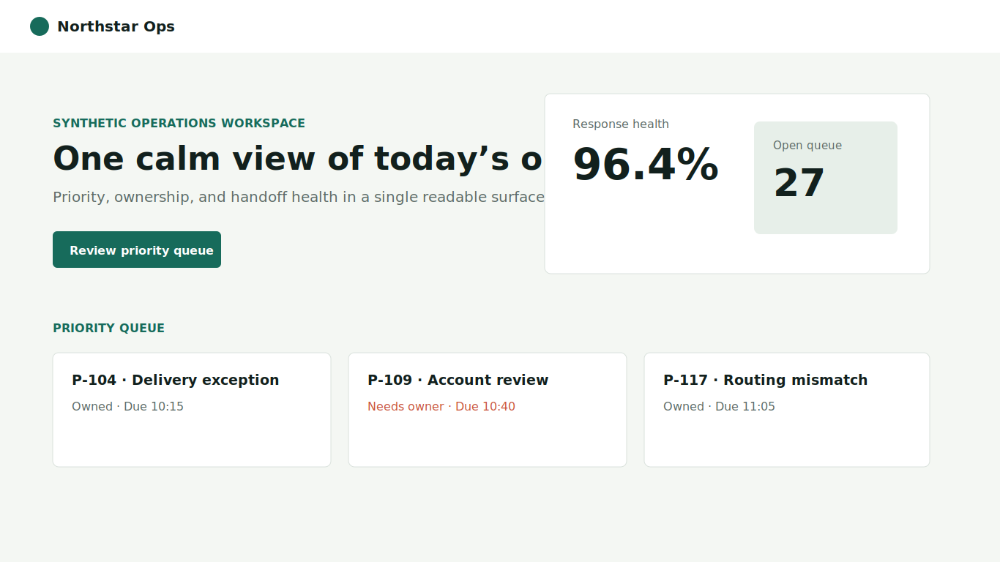

# Northstar operations dashboard

Synthetic Web example. No names, values, or screenshots come from a real
organization.



## Delivery chain

1. **Original:** scattered metrics, equal visual weight, unclear ownership.
2. **Visible direction:** a calm operations surface with one priority path.
3. **Design lock:** `design-lock.json`, approved at 1366 × 768.
4. **Asset manifest:** `asset-manifest.json`; text and controls stay semantic.
5. **Implementation:** dependency-free `index.html`, `styles.css`, `script.js`.
6. **Comparison:** `comparison-summary.json` records the synthetic acceptance.

Open `index.html` directly or serve this directory with:

```bash
python -m http.server 8000
```

The page supports keyboard focus and layouts around 375 px and 1366 px wide.
